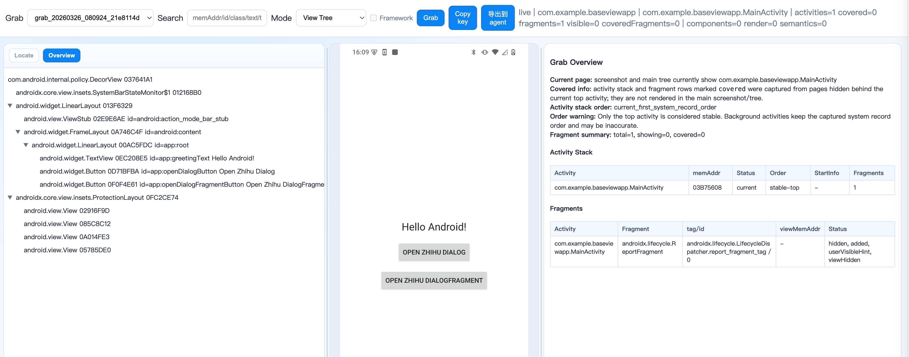
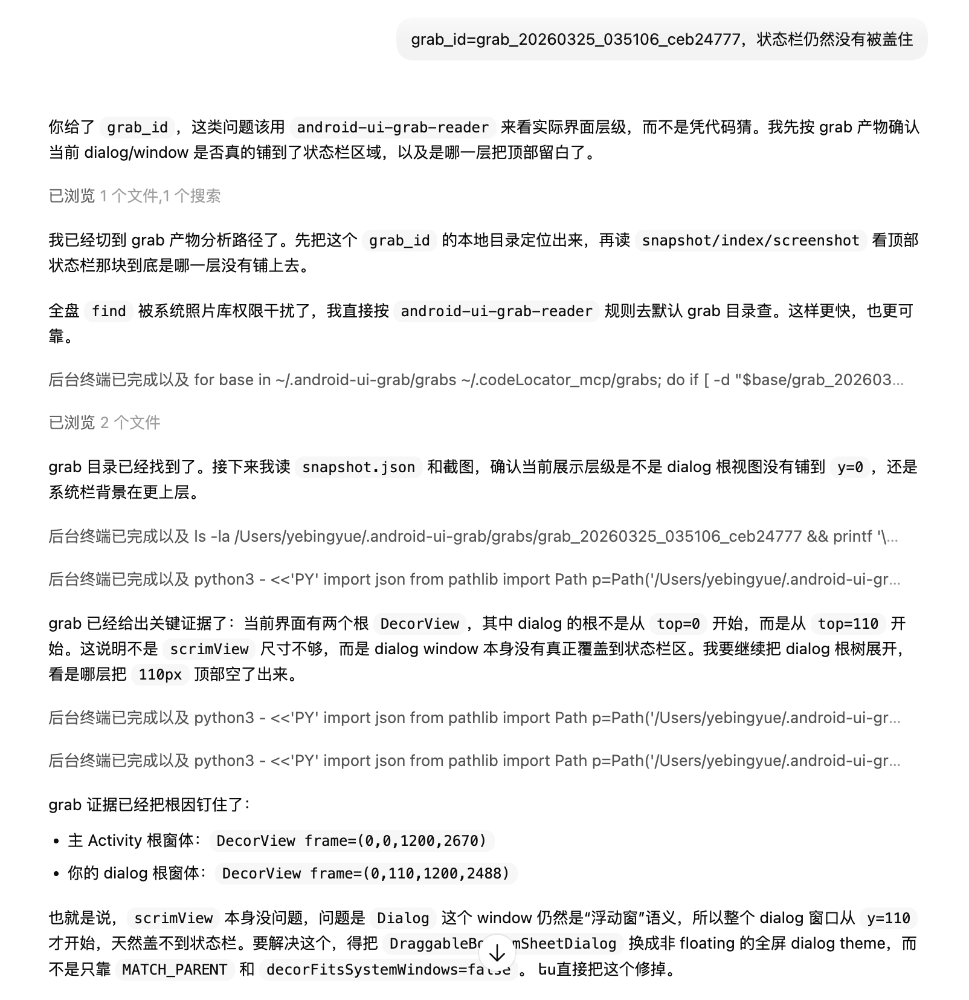

# Android UI Grab

`android-ui-grab` 用于抓取 Android Debug App 的界面结构、截图与 Compose 语义信息，并通过本地 Viewer 做定位和分析。

两步完成接入：

1. android 工程中添加依赖 "com.github.git54496.android-ui-grab-sdk:codelocator-core:v2.1.0-alpha.9"
2. 通过 homebrew 进行安装：

   brew tap git54496/android-ui-grab

   brew install android-ui-grab
3. 开始使用：grab -v

## AI 友好

这个开源工程的一个很实用的点是：它天然适合和 AI 配合使用，帮助你做 UI 问题排查。你可以把它理解成“给 AI 一套能看页面、看树结构、看节点地址的工具链”。

工程里的 skills 目录已经内置了两个可直接复用的 skill。把这两个 skill 目录拷贝到你自己的 skill 库里，就可以开始让 AI 调用它们做 UI 排障。

这两个 skill 分别是：

### `android-ui-grab-usage`

这是“先抓再分析”的编排型 skill。  
适合你只有自然语言描述、还没有明确 `grab_id`、`memAddr`、`id` 或 `text` 的情况，例如“标题展示有问题”“这个按钮点不动”“帮我先抓一下再看看哪个 view 异常”。

它会做的事大致是：

- 先判断你是否已经提供可用的 grab_id
- 如果没有，就直接调用 `grab` 抓取最新页面
- 结合截图、View 树、Activity / Fragment 信息推断候选节点
- 如果无法唯一定位，再让你补充 `memAddr`、`id` 或 `text`
- 目标明确后，再把正式分析交给 `android-ui-grab-reader`

### `android-ui-grab-reader`

这是“基于已有 grab 结果做结构化分析”的读取型 skill。  
适合你已经有 `grab_id`、`grab_dir`、本地路径，或者已经拿到了 `CodeLocator Grab Context`，想让 AI 直接分析页面结构、节点信息、Compose 索引、Activity / Fragment 上下文。

它更适合做这类事情：

- 根据 `grab_id` 读取 `snapshot.json`、`index.json`、截图和 Compose 相关索引
- 分析某个 View 或 Compose 节点为什么显示异常
- 根据 `memAddr`、`idStr`、`text`、`nodeId`、`testTag` 等信息定点定位
- 输出带证据的结论，而不是只给猜测

经典用法通常有三种：

### 1. 直接告诉 AI：“UI 有问题，去 grab”

这是最省事的用法。  
你只需要告诉 AI 某个页面 UI 有问题，让它去 `grab`，AI 就可以自己调用 `grab` 工具抓取当前手机页面，然后继续分析抓到的 View 树、Compose 树、Activity / Fragment 信息，自己定位可疑节点和结构问题。

适合场景：

- 你还没抓数据，想让 AI 从抓取到分析一条龙完成
- 你只能描述“标题不对”“按钮错位”“某个 view 没显示”这类现象

### 2. 你先抓结果，再把 `grab_id` 交给 AI 分析

这是最常见的协作方式。  
你先自己执行 `grab` 命令，拿到一次抓取结果，然后把对应的 `grab_id` 提供给 AI，再直接描述你想排查的问题，例如“帮我分析为什么这个标题没有显示”“帮我看这个按钮为什么点不到”“帮我找 XXX view 在哪一层”。

这样做的好处是：

- 你可以明确指定要分析哪一次抓取结果
- AI 不需要重新抓取，能直接进入结构分析
- 很适合在已经复现过问题、并且抓取结果已经保留下来的情况下使用

### 3. 告诉 AI `grab_id` + `memAddr`，做更精确的定点分析

这是更进阶的用法。使用 grab -v 命令进行 grab 操作同时唤起 viewer 页面。然后拿到 `grab_id` 、`memAddr 等信息`  
如果你已经在 Viewer 里定位到某个可疑节点，可以把 `grab_id` 和对应的 `memAddr` 一起告诉 AI，让它围绕这个具体节点继续分析上下文、父子层级、可见性、尺寸、绑定信息或路径问题。

其中 `memAddr` 可以直接在 Viewer 中看到。有了 `grab_id` 和 `memAddr`，AI 通常能更快缩小范围，避免在整棵树里做大范围搜索。

一句话说：

- 懒人模式：直接让 AI 去 `grab`
- 协作模式：你提供 `grab_id`，AI 帮你分析问题
- 专家模式：你提供 `grab_id` + `memAddr`，AI 做节点级精确排查

## 方案优势

`android-ui-grab` 使用 FE 作为 Viewer 的前端展示形态，界面更直观，交互更顺滑，适合在桌面侧快速完成页面结构查看、问题定位和排查分析。

- 执行 `grab -v` 就可以直接弹出 Viewer 界面
- 同时支持抓取和分析原生 View 与 Compose UI，不需要只围绕传统 View 树做排查。
- 支持截图联动、树节点查看、反选定位等常用操作，便于从页面现象快速回到具体节点。

下面是 Viewer 的示意图：



通过 grab -v 执行 grab 操作+唤起上图的 viewer 页面

## 案例展示

下面是一个基于本仓库进行 `grab` 操作后，进行页面分析的 AI 使用截图：



将工程下 skills 目录中的 skill 复制到 codex 或者 claude code 的 skill 仓库中，即可使用，让 cc 直接读取端上渲染结果

## 快速开始：从 0 开始接入 `android-ui-grab`

如果你的目标是“让一台 Android 手机上的 Debug App 能被 `grab` 抓取并在 Viewer 里分析”，推荐直接按下面这条最短链路接入。整套流程可以理解为两部分：

- 先给 Android App 接入 `android-ui-grab-sdk`
- 再在分析机上安装 `grab` CLI 并执行一次抓取验证

### 第 1 步：给 Android 工程加 JitPack 仓库

在 Android 工程的仓库配置里加入 `jitpack.io`。例如：

```groovy
repositories {
    google()
    mavenCentral()
    maven { url 'https://jitpack.io' }
}
```

如果你已经在 `settings.gradle` 或公司统一脚本里集中管理仓库，只需要确保业务模块最终能解析到 `https://jitpack.io` 即可。

### 第 2 步：给 Debug 包加 `android-ui-grab-sdk`

建议只在 Debug 变体接入，这样不会把抓取能力带进 Release 包：

```groovy
dependencies {
    debugImplementation "com.github.git54496.android-ui-grab-sdk:codelocator-core:v2.1.0-alpha.9"
}
```

其中：

- `codelocator-core` 是必需依赖。
- `codelocator-model` 已经由 `codelocator-core` 传递带上；只有你在业务代码里直接使用 model 包内类型时，才需要额外显式声明。

### 第 3 步：安装 `grab` CLI

如果你还没安装 CLI，先在分析机上执行：

```bash
brew tap git54496/android-ui-grab
brew install android-ui-grab
```

说明：

- 更完整的安装说明见下文“Homebrew 安装（跨机器）”。

### 第 4 步：安装 Debug 包并确认设备连通

```bash
adb devices
./gradlew :app:installDebug
```

要求：

- 手机已开启开发者模式和 USB 调试。
- `adb devices` 能看到目标设备。
- 当前前台运行的是刚接入 `android-ui-grab-sdk` 的 Debug App。

### 第 5 步：执行一次抓取验证接入是否成功

完成前面几步后，直接运行：

```bash
grab -v
```

验证通过的标志：

- 命令执行后能产出新的 `grab_id`。
- 浏览器里能打开 Viewer。
- Viewer 左侧能看到当前页面截图和 View 树。
- Compose 页面还能看到 `compose_index.json` / Compose Semantics 相关信息。

### 第 6 步：接入后常见增强项

- 需要更好的 XML / Dialog / Popup / Toast / ViewHolder 定位信息时，再评估补充 Lancet 相关能力。
- 需要团队内跨机器分发时，业务 App 只负责接入 SDK，分析侧统一安装 `grab` CLI 即可

## CLI 常用命令

```bash
# 实时抓取（可选 --device-serial）
grab
grab live --device-serial <optional>
grab -v
grab live --device-serial <optional> --viewer

# 从文件导入抓取（可选 --path）
grab file --path <optional>
grab file --path <optional> --viewer

# 列出抓取记录
grab list

# 打开 Viewer（指定 grab_id）
grab viewer open --grab-id <grab_id>

# 启动 Viewer 服务
grab viewer serve --port 49622

# 启动 MCP stdio 服务
grab mcp

# 查询 Compose 语义节点（node_id 或 compose_key）
grab inspect compose-node --grab-id <grab_id> --node-id <compose_node_id_or_compose_key>
```

补充说明：

- `grab` 成功后会把抓取结果写到 `~/.android-ui-grab/grabs/<grab_id>/`。
- 常见文件包括 `snapshot.json`、`index.json`、`screenshot.png`，以及 Compose 相关的 `compose_index.json`、`component_index.json`、`render_index.json`、`semantics_index.json`、`link_index.json`。
- 如果你只拿到了 `grab_id`，通常就可以直接去 `~/.android-ui-grab/grabs/<grab_id>/` 找对应产物。

## 当前工程内的 CodingAgent 分析 Skill

当前工程在 `skills/` 下提供了面向 CodingAgent 的 UI 问题分析 skill，目标不是给业务 App 运行，而是让 Agent 能基于 `grab` 产物做可追溯的 UI 排查。

- `android-ui-grab-reader`：当你已经有 `grab_id`、`grab_dir`、`CodeLocator Grab Context` 或一组本地产物路径时，直接读取 `snapshot.json`、截图、View/Compose 索引，分析具体 UI 问题。
- `android-ui-grab-usage`：当你只有自然语言问题描述、还没有明确的 `grab_id` 或目标节点时，先调用 `grab` 获取最新数据，再根据描述推断候选 View，必要时继续转交 `android-ui-grab-reader` 做正式分析。

常见使用 case：

```text
grab_id = 20260326_143015_a1b2c3d4，请分析首页顶部标题显示错位的问题
```

```text
[CodeLocator Grab Context]
grab_id: 20260326_143015_a1b2c3d4
grab_dir: /Users/yourname/.android-ui-grab/grabs/20260326_143015_a1b2c3d4

请分析“立即支付”按钮点击无响应的问题
```

```text
我的标题 view 展示有问题，帮我先抓一下再分析
```

推荐给 Agent 的描述方式：

- 已有抓取结果时：直接给 `grab_id`，再补一句“请分析 xxx 问题”。
- 已知目标更精确时：再补 `memAddr`、`idStr`、`text`、`nodeId`、`composeKey`、`testTag` 等定位信息。
- 只有自然语言现象时：直接描述页面、区域和异常表现，让 `android-ui-grab-usage` 先抓取、再缩小候选范围。

## Compose 兼容说明

- `android-ui-grab` 已支持解析 `mComposeNodes`（`b5`）并生成 `compose_index.json`。
- Viewer 支持显示 Compose Semantics 表格，并支持 `nodeId/testTag/contentDescription` 搜索。
- MCP/CLI 新增 `get_compose_node` 能力，便于按 `node_id` 或 `compose_key` 精确检索。

## Activity 栈与 Fragment 抓取说明

- `grab` 现在会把 activity 栈摘要和 fragment 树一起写进 `snapshot.json` 的 `activityStack` 字段。
- Viewer 主截图和主树仍然只展示当前前台 activity 的页面内容，也就是用户当前真正看到的顶层页面。
- Viewer 右侧默认概览会额外列出 activity 栈和 fragment 摘要：
  - `current`：当前正在展示的 activity / fragment
  - `covered`：已经抓到，但当前被顶层 activity 盖住、不会出现在主截图和主树里的信息
- 因此，做问题分析时要区分两类证据：
  - 主截图、主树、主 overlay：当前页面正在展示的信息
  - `activityStack` 中标记为 `covered` 的 activity / fragment：被盖住的上下文信息，只能作为补充线索，不能直接当作当前截图中的可见元素

## Open Source Notice / 开源声明

### 中文

- 本项目基于开源项目 [bytedance/CodeLocator](https://github.com/bytedance/CodeLocator) 进行二次开发，属于其衍生作品。
- 本项目采用 **Apache License 2.0** 开源，许可证全文见 [LICENSE](./LICENSE)。
- 对上游代码的修改、归属和补充声明见 [NOTICE](./NOTICE)。
- 第三方组件及许可证信息见 [THIRD_PARTY_NOTICES.md](./THIRD_PARTY_NOTICES.md)。
- 除许可证允许的合理描述外，本项目不主张任何上游项目或其权利人的商标授权或官方背书。

### English

- This project is a derivative work based on [bytedance/CodeLocator](https://github.com/bytedance/CodeLocator).
- This repository is released under the **Apache License 2.0**. See [LICENSE](./LICENSE).
- Attribution and modification notices for upstream code are provided in [NOTICE](./NOTICE).
- Third-party components and their licenses are listed in [THIRD_PARTY_NOTICES.md](./THIRD_PARTY_NOTICES.md).
- Except for reasonable descriptive use allowed by license terms, no trademark license or endorsement by upstream right holders is implied.